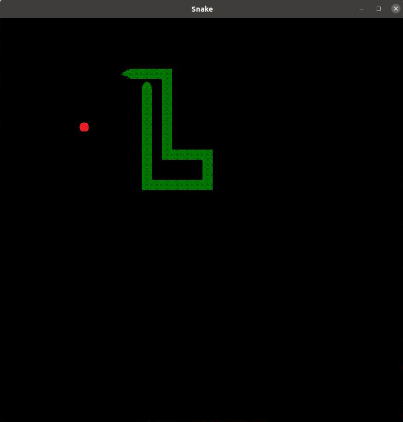

# Snake - definitive edition

## Authors

* [Vicx95](https://github.com/Vicx95/)
* [jakjan95](https://github.com/jakjan95/)
* [matijaz](https://github.com/matijaz)
* [McKucia](https://github.com/McKucia/)
* [pawelnowakGIT](https://github.com/pawelnowakGIT/)
* [anraf1001](https://github.com/anraf1001)

## Screenshots





## Description

Snake is the game where player manaveuers a line which grows in length and this line is itself a primary obstacle, concept orginated in 1976 based on arcade game Blockade.

Game get most popularity from old Nokia phones where it was one of main attraction :)

## Libraries used in project

Game uses SFML library for displaying objects and event handling.

Command to install library : ```sudo apt-get install libsfml-dev```

## How to run

1. Clone repository
2. Inside repository create build directory: ```mkdir build```
3. Open build directory: ```cd build```
4. Create cmake files: ```cmake ..```
5. Build repository: ```make```
6. Run prepared binary file of game: ```./Snake```
7. Have fun :)

## Coming soon...

* Start screen
* Score counter
* End screen with score board
* Speed levels
  * slow
  * average
  * speed
  * hard (speed grows proportionally with snake length)
* Various game board (with special obstacles)
* Special bonus food for snake with extra effects
* and many others.. :)
